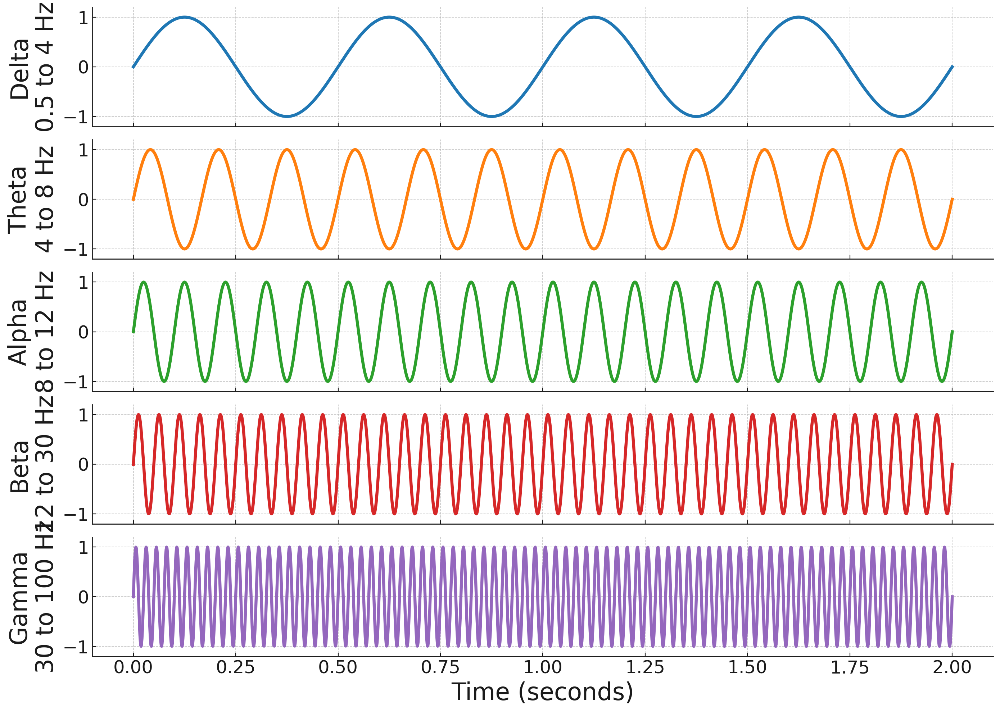

# Electroencephalography (EEG)

*Revised by: Lara, Luna, Chiara, Yuhan*

## Introduction

Electroencephalography (EEG) measures the brain's electrical activity through electrodes placed on the scalp. Since Hans Berger's first human recordings in 1929, EEG has become essential for understanding neural dynamics in both research and clinical contexts. The method's primary advantage is its temporal resolution—capturing neural events within milliseconds—making it invaluable for studying rapid cognitive processes.

EEG is non-invasive and relatively inexpensive compared to other neuroimaging techniques, allowing research with diverse populations including infants, elderly adults, and clinical patients who cannot undergo fMRI scanning.

## Neurophysiological Basis

### Cellular Origins of EEG

EEG signals reflect the summed electrical activity of cortical pyramidal neurons. These cells are arranged perpendicular to the cortical surface, creating oriented electrical dipoles when activated synchronously (Nunez & Srinivasan, 2006). The signal detected at the scalp represents postsynaptic potentials—not action potentials—because these slower potentials last long enough (10-100 ms) to summate across large neuronal populations.

For EEG to detect a signal, approximately 10,000 synchronously active neurons are required (Nunez & Srinivasan, 2006). The orientation and synchrony of these neurons determine whether their electrical fields summate constructively or cancel out.

### Frequency Bands

EEG activity is characterized by oscillations in distinct frequency bands (Klimesch, 1999; Pfurtscheller & Lopes da Silva, 1999):

**Delta (0.5-4 Hz)** is predominant during deep sleep (stages 3-4). Pathological delta activity during wakefulness indicates cortical dysfunction.

**Theta (4-8 Hz)** is associated with drowsiness, light sleep, and cognitive processes including memory encoding. Frontal midline theta appears during focused attention and working memory tasks.

**Alpha (8-12 Hz)** is most prominent over posterior regions during wakeful rest with eyes closed. Alpha suppression occurs when visual processing begins, demonstrating sensory gating.

**Beta (12-30 Hz)** reflects active cognitive processing, motor planning, and sensorimotor integration. Desynchronization appears during movement preparation.

**Gamma (30-100 Hz)** is associated with attention, consciousness, and binding of distributed neural representations. Evidence suggests gamma oscillations coordinate information across brain regions (Fries, 2009).

*Figure 2: EEG frequency bands. From course materials.*

## Recording Methods

### The 10-20 System

The International 10-20 system positions electrodes based on proportional skull measurements, ensuring reproducibility across laboratories and participants (Jasper, 1958). Electrode locations are named by region (F=frontal, C=central, P=parietal, O=occipital, T=temporal) and hemisphere (odd numbers=left, even numbers=right, z=midline). Higher-density systems (64, 128, or 256 channels) improve spatial sampling but require longer preparation time and more complex analysis.

### Signal Acquisition

Modern systems use active electrodes with pre-amplification, reducing susceptibility to external noise. Electrode impedance should remain below 5 kΩ, requiring proper skin preparation with abrasive gel or alcohol.

The reference electrode provides a baseline for measuring voltage differences. Common schemes include linked mastoids or earlobes (physically or mathematically linked), average reference (mean of all electrodes), and Laplacian reference (surrounding electrodes). Reference choice affects signal interpretation, as there is no "true" electrical zero point in the brain.

EEG signals (10-100 µV) require amplification by 10,000-100,000 times. Analog filters prevent aliasing, while digital filters remove specific noise sources: high-pass filters (0.1-1 Hz) remove slow drift, low-pass filters (30-100 Hz) attenuate muscle activity, and notch filters (50 or 60 Hz) remove power line interference. The Nyquist theorem requires sampling at least twice the highest frequency of interest. Standard rates range from 250 Hz (adequate for most EEG) to 1000 Hz or higher for detailed analysis of high-frequency activity.

### Artifact Identification and Removal

Common artifacts contaminate EEG recordings. Eye movements create large voltage deflections due to the corneoretinal potential, with blinks producing characteristic frontal-central positivity. EOG electrodes placed above and beside the eyes help identify these artifacts. EMG from jaw, neck, and facial muscles produces high-frequency noise (20-300 Hz). Participant relaxation and electrode placement away from muscle groups minimize this interference. Cable movements and electrode displacement create large, often non-physiological signals. Securing cables and ensuring stable electrode contact reduce these artifacts.

Independent Component Analysis (ICA) separates EEG into statistically independent components, allowing removal of artifact components while preserving brain signals (Makeig et al., 1996). Regression methods can also remove stereotyped artifacts like eye movements when reference channels (EOG) are available.

## Event-Related Potentials

ERPs isolate brain responses to specific events by averaging EEG segments time-locked to stimulus presentation. Averaging across trials (typically 20-100 repetitions) reduces random background EEG, revealing systematic event-related activity.

### Key ERP Components

The **P300 (P3)** is a positive deflection peaking 300-500 ms post-stimulus, maximal at parietal electrodes. The P300 reflects stimulus evaluation and working memory updating. Amplitude increases with task relevance and decreases with probability—demonstrating sensitivity to expectation violations. The "oddball paradigm" elicits robust P300 responses by embedding rare target stimuli among frequent standards (Polich, 2007).

The **N170** is a negative peak at 170 ms over occipitotemporal sites, particularly responsive to faces. The N170 reflects structural encoding of faces and shows expertise effects—larger for faces than other objects in most individuals (Rossion & Jacques, 2008).

The **N400** shows a negative peak at 400 ms over central-parietal sites, sensitive to semantic processing. N400 amplitude increases for semantically incongruent or unexpected words, providing a real-time index of meaning integration (Kutas & Federmeier, 2011).

The **Mismatch Negativity (MMN)** is a pre-attentive change detection response, appearing 150-250 ms after a deviant stimulus. MMN occurs even without conscious attention, reflecting automatic sensory memory comparison (Näätänen et al., 2007).

## Research Applications

### Cognitive Neuroscience

Alpha power modulates with spatial attention—decreasing over cortical regions processing attended locations while increasing over regions processing unattended locations (Worden et al., 2000). Theta oscillations in frontal and temporal regions support memory encoding and retrieval, while gamma oscillations correlate with successful memory formation (Sederberg et al., 2003). ERPs like N400 and P600 track semantic and syntactic processing in real time, revealing how meaning and structure are integrated during language comprehension. Pre-response neural activity predicts choices, with beta oscillations reflecting motor preparation and frontal theta reflecting conflict monitoring.

### Clinical Applications

EEG remains the primary tool for diagnosing epilepsy. Interictal spikes and sharp waves indicate epileptogenic regions, while ictal recordings capture seizure onset and propagation patterns. Polysomnography combines EEG with EOG and EMG to classify sleep stages and identify disorders like sleep apnea, narcolepsy, and REM behavior disorder. Electrocerebral silence (absent EEG activity) contributes to brain death diagnosis, though strict criteria must be met regarding recording conditions and artifact exclusion.

Operant conditioning of specific EEG frequencies has been used to treat ADHD, anxiety, and epilepsy. However, evidence remains mixed, and placebo effects complicate interpretation (Thibault et al., 2018).

## Limitations

EEG poorly localizes signal sources. Volume conduction through tissue layers blurs the spatial distribution, and the "inverse problem"—determining source configuration from scalp recordings—has no unique solution without additional constraints. EEG primarily reflects cortical activity; subcortical structures like the thalamus or basal ganglia produce signals too weak or disorganized to detect at the scalp. Muscle activity, movement, and electrical interference easily contaminate recordings, requiring careful experimental control and sophisticated artifact correction. Skull thickness, cortical folding patterns, and baseline brain activity vary across individuals, complicating group analyses and requiring large sample sizes.

## Comparison with Other Methods

Magnetoencephalography (MEG) measures magnetic fields generated by neural activity. MEG offers better spatial resolution because magnetic fields are less distorted by skull and tissue. However, MEG is extremely expensive and requires magnetically shielded rooms. Functional MRI measures blood oxygenation changes (BOLD signal) with millimeter spatial resolution but ~1-2 second temporal resolution. EEG provides millisecond timing but centimeter spatial resolution. Combined EEG-fMRI leverages complementary strengths (Mulert & Lemieux, 2010). Positron emission tomography maps metabolic activity with good spatial resolution but requires radioactive tracers and provides only averaged activity over minutes. EEG is non-invasive and tracks rapid dynamics.

## Advanced Analysis Methods

Computational methods estimate cortical sources of scalp-recorded activity. Techniques include dipole fitting (modeling discrete sources) and distributed source modeling (estimating activity across the entire cortical surface). Accuracy improves when incorporating individual MRI scans for realistic head models. Wavelet transforms and Hilbert transforms decompose EEG into time-varying frequency components, revealing transient oscillatory dynamics not apparent in averaged ERPs. Coherence, phase-locking value, and Granger causality quantify functional connectivity between brain regions, characterizing network-level dynamics during cognitive tasks. Pattern classification algorithms decode cognitive states from EEG patterns, enabling brain-computer interfaces and real-time neurofeedback applications.

## References

Fries, P. (2009). Neuronal gamma-band synchronization as a fundamental process in cortical computation. *Annual Review of Neuroscience*, 32, 209-224. https://doi.org/10.1146/annurev.neuro.051508.135603

Jasper, H. H. (1958). The ten-twenty electrode system of the International Federation. *Electroencephalography and Clinical Neurophysiology*, 10, 371-375. https://doi.org/10.1016/0013-4694(58)90053-1

Klimesch, W. (1999). EEG alpha and theta oscillations reflect cognitive and memory performance: A review and analysis. *Brain Research Reviews*, 29(2-3), 169-195. https://doi.org/10.1016/S0165-0173(98)00056-3

Kutas, M., & Federmeier, K. D. (2011). Thirty years and counting: Finding meaning in the N400 component of the event-related brain potential (ERP). *Annual Review of Psychology*, 62, 621-647. https://doi.org/10.1146/annurev.psych.093008.131123

Makeig, S., Bell, A. J., Jung, T. P., & Sejnowski, T. J. (1996). Independent component analysis of electroencephalographic data. *Advances in Neural Information Processing Systems*, 8, 145-151.

Mulert, C., & Lemieux, L. (Eds.). (2010). *EEG-fMRI: Physiological basis, technique, and applications*. Springer. https://doi.org/10.1007/978-3-540-87919-0

Näätänen, R., Paavilainen, P., Rinne, T., & Alho, K. (2007). The mismatch negativity (MMN) in basic research of central auditory processing: A review. *Clinical Neurophysiology*, 118(12), 2544-2590. https://doi.org/10.1016/j.clinph.2007.04.026

Nunez, P. L., & Srinivasan, R. (2006). *Electric fields of the brain: The neurophysics of EEG* (2nd ed.). Oxford University Press. https://doi.org/10.1093/acprof:oso/9780195050387.001.0001

Pfurtscheller, G., & Lopes da Silva, F. H. (1999). Event-related EEG/MEG synchronization and desynchronization: Basic principles. *Clinical Neurophysiology*, 110(11), 1842-1857. https://doi.org/10.1016/S1388-2457(99)00141-8

Polich, J. (2007). Updating P300: An integrative theory of P3a and P3b. *Clinical Neurophysiology*, 118(10), 2128-2148. https://doi.org/10.1016/j.clinph.2007.04.019

Rossion, B., & Jacques, C. (2008). Does physical interstimulus variance account for early electrophysiological face sensitive responses in the human brain? *NeuroImage*, 39(4), 1820-1832. https://doi.org/10.1016/j.neuroimage.2007.10.011

Sederberg, P. B., Kahana, M. J., Howard, M. W., Donner, E. J., & Madsen, J. R. (2003). Theta and gamma oscillations during encoding predict subsequent recall. *Journal of Neuroscience*, 23(34), 10809-10814. https://doi.org/10.1523/JNEUROSCI.23-34-10809.2003

Thibault, R. T., MacPherson, A., Lifshitz, M., Roth, R. R., & Raz, A. (2018). Neurofeedback with fMRI: A critical systematic review. *NeuroImage*, 172, 786-807. https://doi.org/10.1016/j.neuroimage.2017.12.071

Worden, M. S., Foxe, J. J., Wang, N., & Simpson, G. V. (2000). Anticipatory biasing of visuospatial attention indexed by retinotopically specific alpha-band electroencephalography increases over occipital cortex. *Journal of Neuroscience*, 20(6), RC63. https://doi.org/10.1523/JNEUROSCI.20-06-j0002.2000

**[Back to Main](../README.md)**
